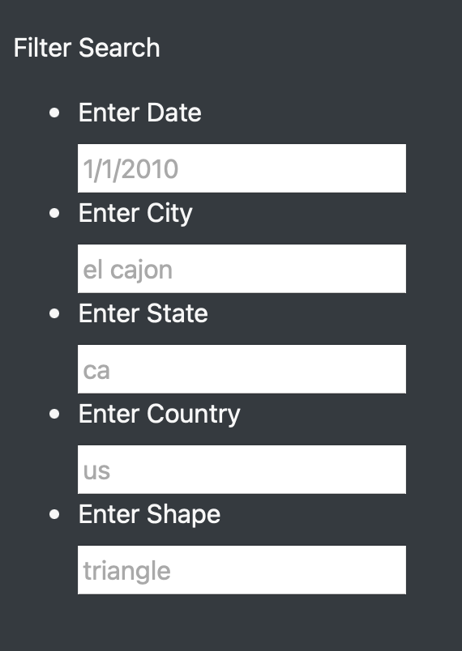
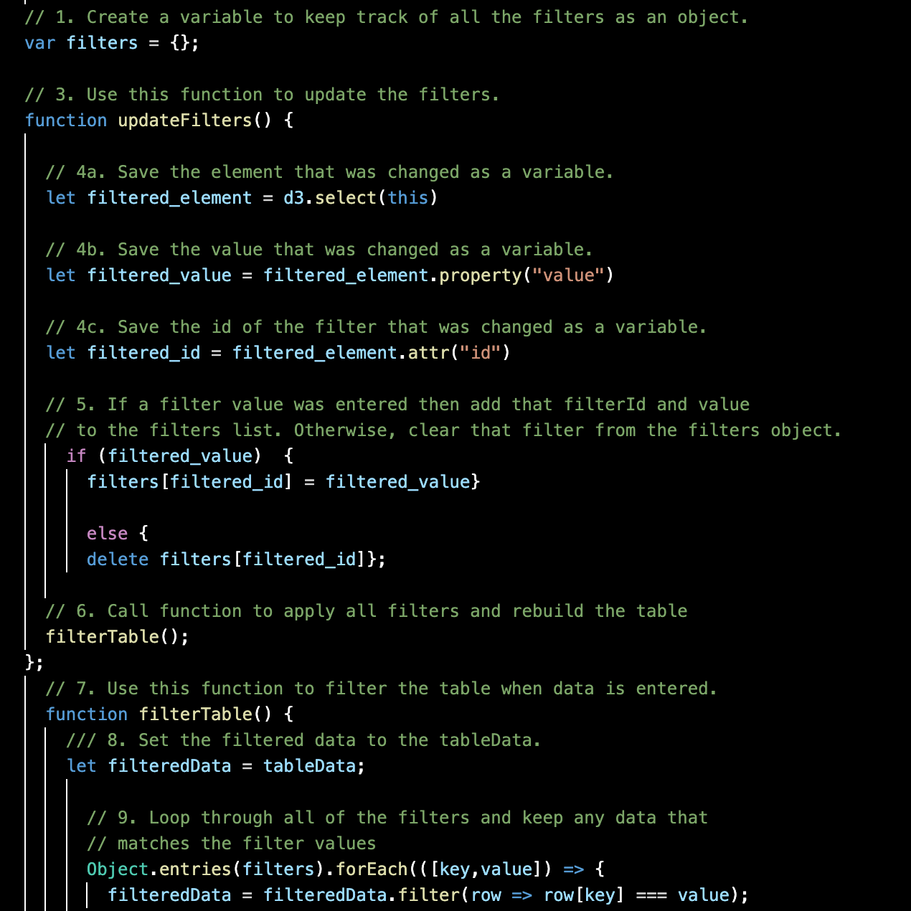

# UFO_sightings-analysis
## Overview
The purpose of the porject is to further develop an existing webpage's capabilities.  The current webpage only allows for information in the tabl to be filtered by date, so the goal was to build out the filtering capabilities. The end result is to allow users to filter on different criteria in order to narrow their search for UFO sightings

## Results
To narrow one's search, filters can be applied to each of the five categories:  date, city, state, country, and shape.

The code is written such that a change to any one of the filters is noticed and added to filters variable containing the id of the filter as well as the specified value.  The code then signals for only data meeting all filter specifications to display in the table on the website.

## Summary
One drawback to the webpage is that users do not know all values to use as inputs for the filters. For example, they may not know all possible UFO shapes and all the cities, states, and coutnries where the sightings occured.  This requires users to do their own research and troublshoot their filtering parameters.

To fix the aforementioned drawback, adding drop down menus to the filters would provide a more user friendly experience.  In addition, to help make the webpage more useful to users, a recommendation is to add a summary of where the majority of sightings occured or the most common shapes. 

A last recommendation is to allow the data to be exported from the website so users can perform their own analysis on the data. 
